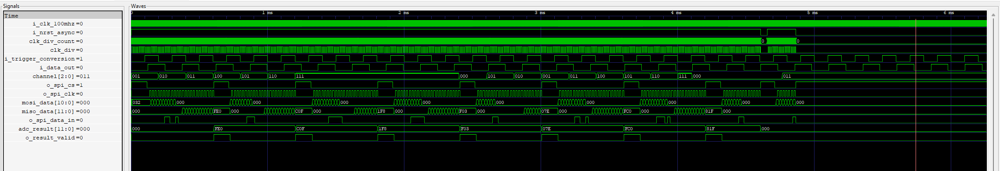

# spi_master
This project is a custom SPI Master for 8 Channel 12-Bit ADC MCP3208. It could also be used for a 4-Channel 12-Bit ADC MCP3204.
- The input configuration is single ended rather than differential in this case. 
## Datasheet Reference 
This project is based on the MCP3208 ADC. For complete details, refer to the official [MCP3208 Datasheet](https://ww1.microchip.com/downloads/en/DeviceDoc/21298e.pdf) provided by Microchip Technology Inc.

## Explanation 
- The complete transaction of writing and reading the data happens in 24 CLK Pulses.
- In the first 12 pulses we write the nature of input configuration and the channel selection.
- In the next 12 pulses we read the Digital code word of the analog voltage. 

## Future Scope 
To implement a multi slave / multi peripheral spi master. 

